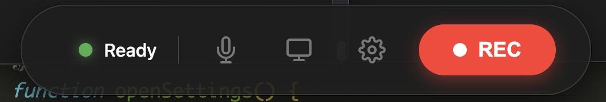

# Screen Sider

一个基于Electron开发的跨平台屏幕录制工具，支持全屏录制、窗口切换、麦克风音频和摄像头画中画功能。

## 📸 预览



## ✨ 功能特性

- **屏幕录制**
  - 支持全屏录制
  - 支持特定窗口录制
  - 窗口切换功能

- **音频录制**
  - 麦克风音频录制
  - 可随时开启/关闭

- **摄像头支持**
  - 画中画功能
  - 可随时开启/关闭

- **格式选择**
  - 默认MP4格式
  - 支持WebM格式
  - 独立设置窗口

- **界面设计**
  - 简约扁平化风格
  - 无边框设计
  - 自适应布局

## 🚀 快速开始

### 安装依赖

```bash
npm install
```

### 开发模式

```bash
npm run dev
```

### 构建应用

```bash
# 构建所有平台
npm run build

# 仅构建 macOS 平台
npm run build:mac

# 仅构建 Windows 平台
npm run build:win

# 仅构建 Linux 平台
npm run build:linux
```

## 🛠 技术栈

- **Electron** - 跨平台桌面应用开发框架
- **JavaScript** - 主要开发语言
- **HTML/CSS** - 界面设计
- **MediaRecorder API** - 音视频录制
- **Desktop Capturer** - 屏幕捕获

## 📁 项目结构

```
screen-recorder-pro/
├── index.html          # 主窗口HTML
├── main.js             # 主进程
├── renderer.js         # 渲染进程
├── style.css           # 主窗口样式
├── settings.html       # 设置窗口HTML
├── settings.css        # 设置窗口样式
├── settings.js         # 设置窗口脚本
├── camera-overlay.html # 摄像头窗口HTML
├── camera-overlay.js   # 摄像头窗口脚本
├── screen-selector.html # 屏幕选择窗口HTML
├── screen-selector.js  # 屏幕选择窗口脚本
├── error.html          # 错误窗口HTML
├── activate-window.scpt # AppleScript窗口激活脚本
├── package.json        # 项目配置
├── preview/            # 预览图
│   └── preview-01.png  # 应用预览图
└── README.md           # 项目说明
```

## 📖 使用说明

1. **启动应用**
   - 运行`npm run dev`或双击构建后的应用程序

2. **录制控制**
   - 点击红色录制按钮开始/停止录制
   - 录制过程中状态栏显示"Recording"

3. **窗口切换**
   - 点击窗口切换按钮选择要录制的窗口
   - 选择后自动激活目标窗口

4. **麦克风控制**
   - 点击麦克风按钮开启/关闭麦克风
   - 开启时按钮变为白色

5. **摄像头控制**
   - 点击摄像头按钮开启/关闭摄像头
   - 开启时显示摄像头画中画

6. **格式设置**
   - 点击设置按钮打开设置窗口
   - 选择MP4或WebM格式
   - 默认格式为MP4

## 🎯 核心功能实现

### 屏幕录制
使用Electron的Desktop Capturer API捕获屏幕或窗口内容，结合MediaRecorder API进行录制。

### 音频处理
通过getUserMedia API获取麦克风音频，动态管理音频轨道的启用/禁用状态。

### 摄像头画中画
创建独立的摄像头窗口，使用getUserMedia API获取摄像头流，实现画中画效果。

### 格式支持
使用MediaRecorder.isTypeSupported()检测支持的视频格式，支持MP4和WebM格式的录制与保存。

### 窗口管理
实现了主窗口、设置窗口、摄像头窗口、屏幕选择窗口和错误提示窗口的创建与管理。

## 🔧 配置说明

### 视频格式设置

默认格式为MP4，可在设置窗口中切换为WebM格式：

```javascript
// 默认格式配置
let selectedFormat = 'mp4';
```

### 窗口位置

主窗口默认位于屏幕底部中央，可根据屏幕尺寸自动调整：

```javascript
x: Math.floor((screenWidth - 500) / 2), // 水平居中
y: Math.floor(screenHeight - 120), // 底部120px位置
```

## 📝 注意事项

1. 首次使用需要授予屏幕录制、麦克风和摄像头权限
2. 录制过程中请勿关闭应用程序
3. 录制文件默认保存在下载文件夹中
4. 支持MacOS、Windows和Linux平台

## 📄 许可证

ISC License

## 🤝 贡献

欢迎提交Issue和Pull Request！

## 📧 联系方式

如有问题或建议，请联系：zeki.he@foxmail.com
